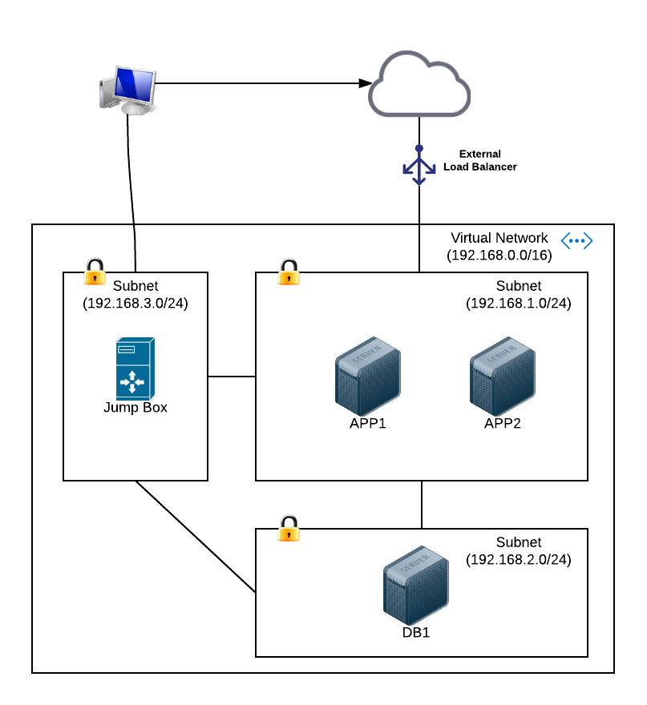

# How to deploy a secure, multi-node Linux cluster on Azure

In this example, we are essentially specifying the deployment architecture of our infrastucture in 
[code](https://en.wikipedia.org/wiki/Infrastructure_as_Code).  Because the templates are highly readable 
(you just need to understand the ARM template structure), it is self-documenting.  Therefore, 
you have [executable documentation](http://www.agilemodeling.com/essays/agileDocumentationBestPractices.htm), 
this in turn, enables the ability to repeatedly, consistently deploy your 
infrastructure.  Now you can provision environments as needed, bring them down as needed, all in an automated manner! 

This example deploys an HA (using availability sets), Linux VM cluster within a virtual network/subnet
that is secured through NSG (network security group) rules. In a future session, we will use custom script extensions to 
install Ansible on all the VMs and deploy a containerized node.js application using docker compose and docker swarm. 

## Deployment Architecture

### How to run this solution

1. Install Azure CLI.  The instructions for your OS is [here](https://docs.microsoft.com/en-us/azure/xplat-cli-install). 
2. Have a valid Azure Account.  Go to the [MS Azure site](https://azure.microsoft.com/en-us/) and follow the instructions.
3. See the rest of the instructions in [arm/README](arm/README.md)  

### References

1. [Authoring ARM Templates](https://docs.microsoft.com/en-us/azure/azure-resource-manager/resource-group-authoring-templates)
2. [ARM Template Walkthrough](https://docs.microsoft.com/en-us/azure/azure-resource-manager/resource-manager-template-walkthrough)
3. [Azure REST API Reference](https://docs.microsoft.com/en-us/rest/api/)
4. [Azure Virtual Networks](https://docs.microsoft.com/en-us/azure/virtual-network/virtual-networks-overview)
5. [Azure Linux Virtual Machines](https://docs.microsoft.com/en-us/azure/virtual-machines/linux/)
6. [Azure Network Security Groups](https://docs.microsoft.com/en-us/azure/virtual-network/virtual-networks-nsg)
7. [Azure Load Balancer Overview](https://docs.microsoft.com/en-us/azure/load-balancer/load-balancer-overview)
8. [NSG template example](https://raw.githubusercontent.com/telmosampaio/azure-templates/master/201-IaaS-WebFrontEnd-SQLBackEnd/NSGs.json)
9. [Azure Storage](https://docs.microsoft.com/en-us/azure/storage/)
10. [Azure CLI Command Reference](https://docs.microsoft.com/en-us/azure/virtual-machines/azure-cli-arm-commands#azure-group-commands-to-manage-your-resource-groups)

