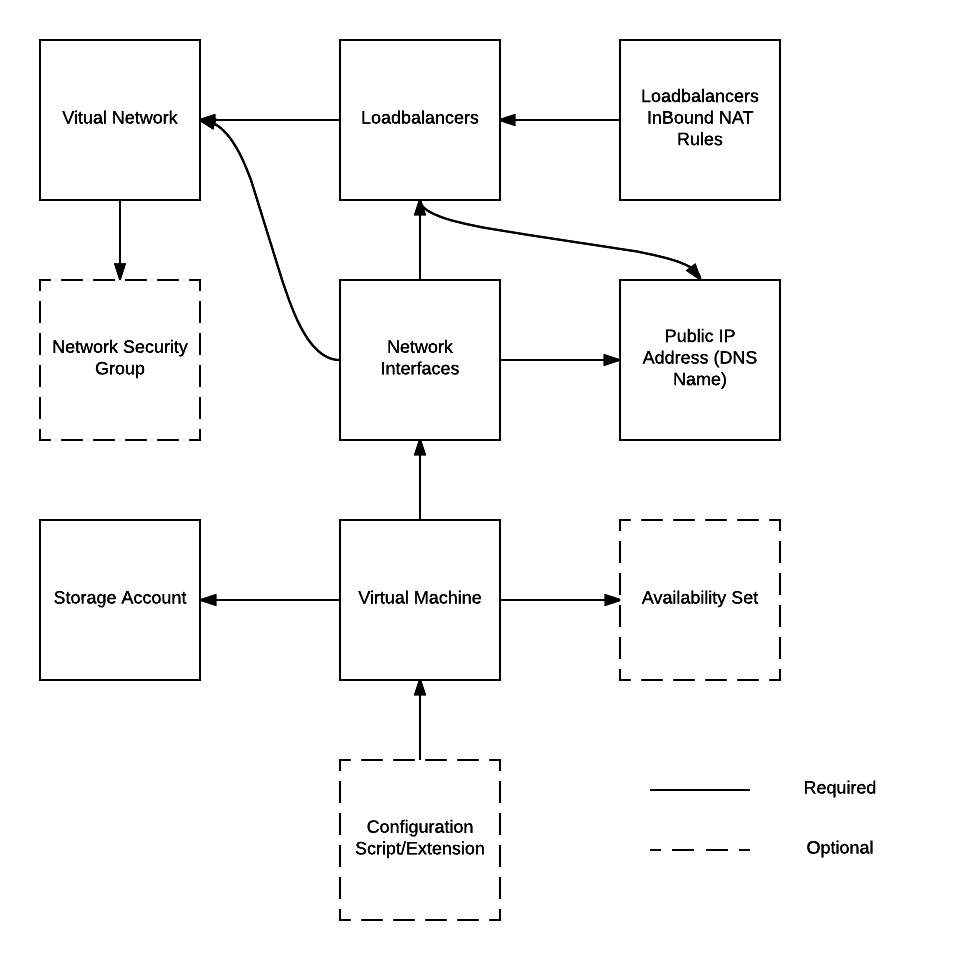

# ARM Template Deployment

There are 2 json templates that make up the deployment. Note that all the resources are defined in a single template.  This is not best practice.  In the next session, I will show how templates should be composed of multiple resource specific templates to promote re-use.
Also, although I leverage Azure Key Vault to store secrets such as the admin password, I am not using ssh authentication because Key Vault currently does not seem to support template deployment with ssh keys stored in the key vault.

The [azureDeploy.parameters.json](./azureDeploy.parameters.json) template contains the parameters you need to provide. 
The [azureDeploy.json](./azureDeploy.json) is the template the defines the ARM resources and dependencies. This is the core template that specifies your deployment architecture as executable documentation.

In order to execute these templates, you need to have a pre-existing storage account, it must be a 'General Purpose' account.  Provide the name of the storage account in the parameters template.
You also need to have a pre-existing Azure Key Vault resources with a secret named 'adminPassword' that stores the admin user password.  Go to [here](https://docs.microsoft.com/en-us/azure/azure-resource-manager/resource-manager-keyvault-parameter) for instructions.

To deploy the template using Azure CLI execute the following commands.  Note, I assume the storage account resource group has already been created.

```
#login to azure and follow the instructions
azure login

#Create a resource group, location would be "Canada East"
azure group create -n <resource-group-name> -l <location>

#Always validate the template prior to trying to deploy it to catch any errors that may exist. The '-vv' switch means 'verbose'
azure group template validate -f azureDeploy.json -e azureDeploy.parameters.json -g <resource-group-name> -vv

#if the template is valid...
azure group deployment create -f azureDeploy.json -e azureDeploy.parameters.json -g <resource-group-name> -n <deploy-name>
```
## Getting help with azure CLI

```

#to access help do this...
azure help <command>

#for example, for 'azure group template validate...'  you would do this...
azure help group template validate

```
The following resources are deployed in this template.

1. Virtual Network with 3 subnets (app, db, jumpbox)
2. External load balancer
3. Network Security Group rules for the three subnets
4. Public IP Address with associated DNS name for both the load balancer and jumpbox vm
5. Network Interfaces
6. Virtual Machines
7. Storage Account for the VM OS and Data disks
8. Availability Set for the app and db subnets

## ARM Resource Dependencies 

Certain ARM resources cannot exist unless another resource exists.  For example, a virtual machine cannot exist without a storage account and disks.  Below is a diagram of the dependencies you need to be aware of you when you author ARM templates.  Dependencies are defined in the templates using the 'dependsOn' property of the resource object and implicitly using the reference function (we will cover this in a future session).



## Tips and Tricks

1. Use [Visual Studio Code](https://code.visualstudio.com/) to author ARM templates.  Code is a fantastic, fast editor for Windows, macOS and Linux.
2. Install Visual Studio Code [ARM snippets](https://docs.microsoft.com/en-us/azure/azure-resource-manager/resource-manager-vs-code).  They are very helpful to get a template going. 
3. Bookmark this [page](https://docs.microsoft.com/en-us/azure/azure-resource-manager/resource-manager-template-best-practices). 
All the necessary docs related to ARM from MS starts there, and it is very good.
4. To learn create your architecture manually via the portal.  You can then export the generated template.  See what is generated and refactor to be more resuable.  This is a great way to learn.
5. Don't just start writing templates.  Whiteboard a deployment diagram, identify all resources, their dependencies, make decisions on how you will group them into resource groups.  Start to define the resources within the template based on dependency order.
6. Read [this document](https://docs.microsoft.com/en-us/azure/azure-resource-manager/best-practices-resource-manager-design-templates) first. You can read it over a coffee, and it will set you on the right path.
7. Azure Resources have different naming restrictions.  In order to save you some hassle, read this [doc](https://docs.microsoft.com/en-us/azure/guidance/guidance-naming-conventions).
8. Bookmark the [Azure REST API Reference](https://docs.microsoft.com/en-us/rest/api/). All the JSON schema for each resource is documented there.
9. You will be referencing resources by resourceId in your templates.  Understand the structure of the generated resource. See the REST API reference.


